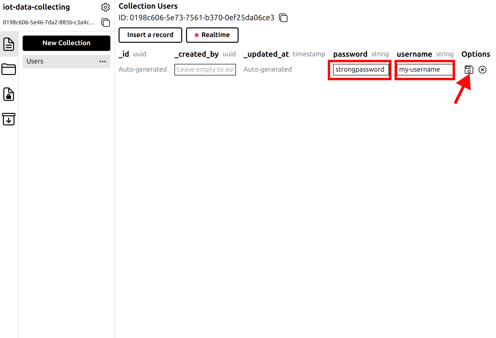

# Hyperbase Integration for Home Assistant
Integration component for [Hyperbase](https://github.com/HyperbaseApp/hyperbase) local IoT data center system. Perform Iot devices data collecting without complex database configurations.

## :wrench: Installation

1. Open **HACS** in Home Assistant
2. Find **"Custom repositories"** in the option
3. Enter `https://github.com/eclipseron/homeassistant-hyperbase.git`. Choose **"Integration"** for the Type input.
4. Click **Add**.
5. Search for **"Hyperbase"** in HACS. Press **Download** and restart your HA.
6. Go to **Settings > Devices & services > + Add integration**.
7. Find **"Hyperbase"** and start the integration setup.

## :gear: Initial Setup

### :one: Hyperbase Setup

You can follow Hyperbase installation guide from [documentation](https://hyperbase-book.hilmy.dev/03_installation/04_setup/04_hyperbase) to create your Hyperbase instance. Once the installation ready, create new Hyperbase admin account and login. Now, you can [create a new Project](https://hyperbase-book.hilmy.dev/02_quick_start/04_create_project).

1. Inside the new project, you can find a "User" collection that is already created. Select the "User" collection and **Insert a record**.
  

1. Enter a username and password to identify the owner of each records. You can use your Home Assistant account or create new one. This user record be used to authorize MQTT publish from HA. Hit the save button when you are done.
  

3. You can find three-dots icon  on the right side of the "User" collection. Click it and choose **Edit**.
  

4. Check the **Using the _id field to authenticate MQTT publishers** option then press **Edit**.
  

### :two: Create New Hyperbase Integration

1. On the Home Assistant web UI, go to **Settings > Devices & services > Add integration**. Search for "Hyperbase" and select the integration.
  

2. Fill all required fields with your Hyperbase configuration. Press **Submit** to continue.
> Hyperbase Base URL **is not** URL of the Hyperbase UI but [Hyperbase server](https://hyperbase-book.hilmy.dev/04_features/12_change_server).

  

3. Enter your Hyperbase administrator credentials into email and password fields. **Hyperbase Project ID** and **Home Assistant User ID** can be found here:
  

4. Press **Submit** and wait for the start up process. You can access Hyperbase integration service by clicking the card on Integrations page (**Settings > Devices & services**).
  

## :pencil2: Features
- **Connected with Hyperbase**: Configure Hyperbase connection through UI without coding needed.
- **Full Control Over Your Data**: Choose what information you need to store, change whenever you want.
- **Regular Consistency Check**: Regularly check connection between HA and Hyperbase. Data collecting failures handled with no worries.

## :book: Documentation
Hyperbase Documentation: https://github.com/HyperbaseApp/hyperbase

Hyperbase for HA Documentation: https://eclipseron.github.io/homeassistant-hyperbase
